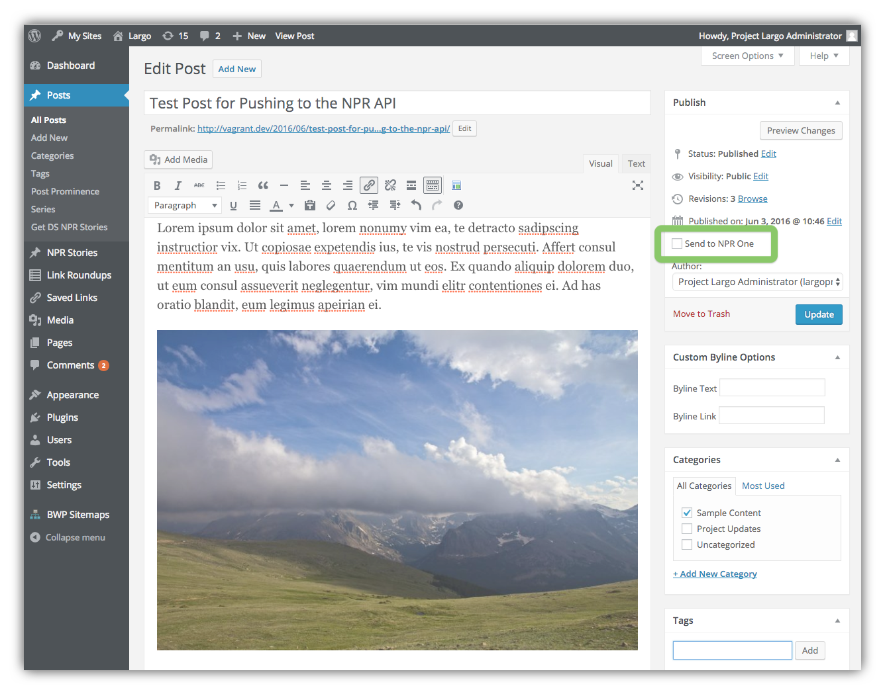

# Pushing Posts to NPR One

You can easily push posts to the [NPR One mobile app](https://www.npr.org/about/products/npr-one/) in addition to the NPR Story API.

After you [set up the WordPress NPR Story API Plugin](settings.md) with your API Key and Org ID, you will see a new checkbox in the Post Edit screen for "Include for listening in NPR One":

The checkbox is not selected by default. This allows you to push all your stories to the NPR Story API, but only selected stories to NPR One.

If you want to push a post to NPR One, check the box and hit the Publish or Update button.

If you are sending the story to NPR One, you can also choose to mark the story as a featured story in NPR One.
