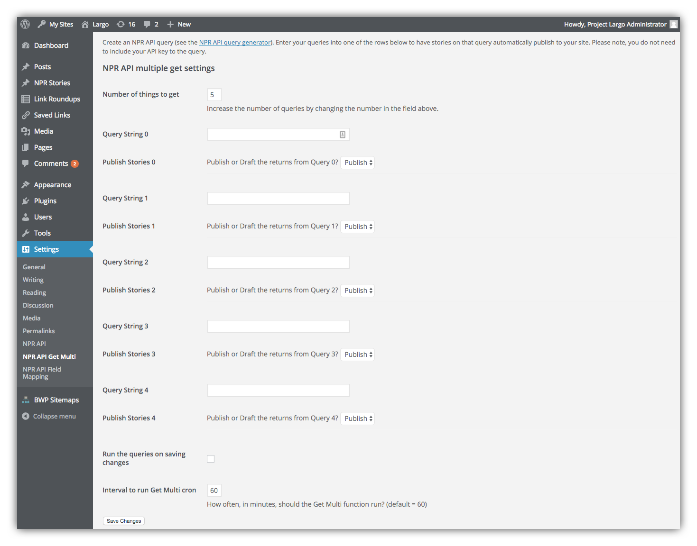
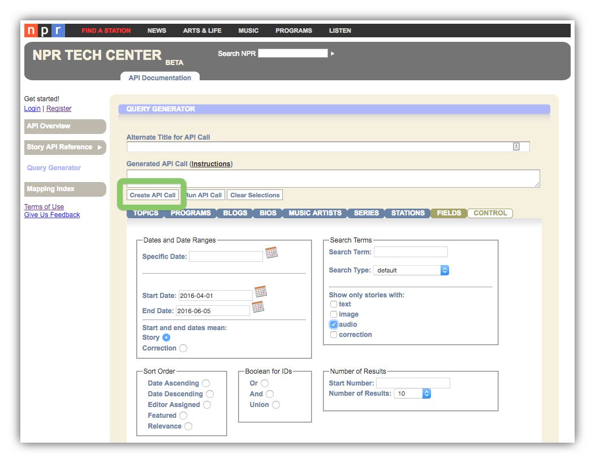
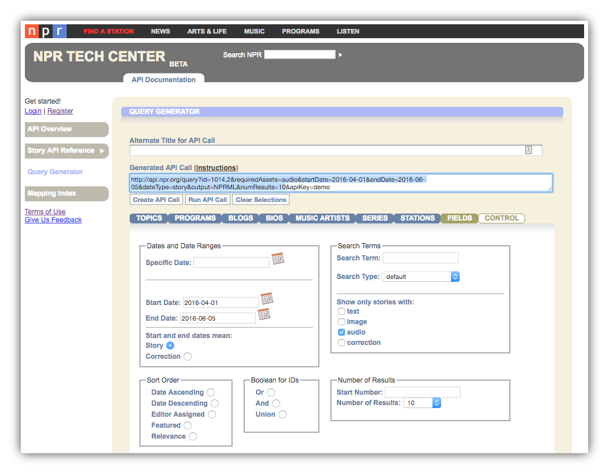
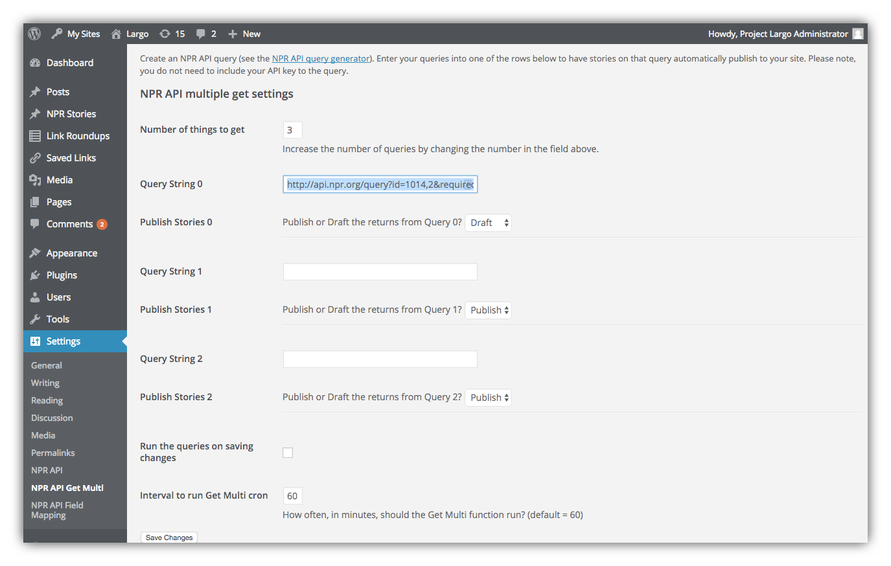
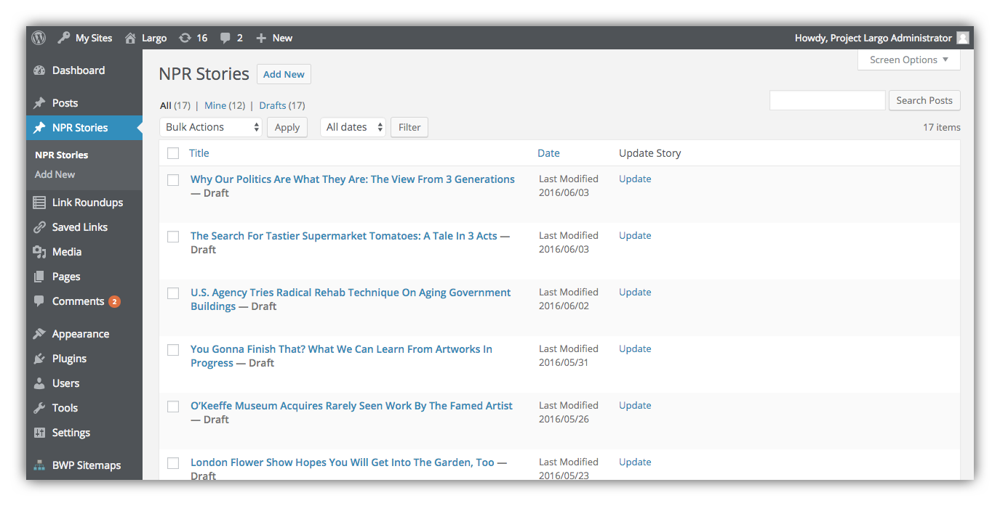
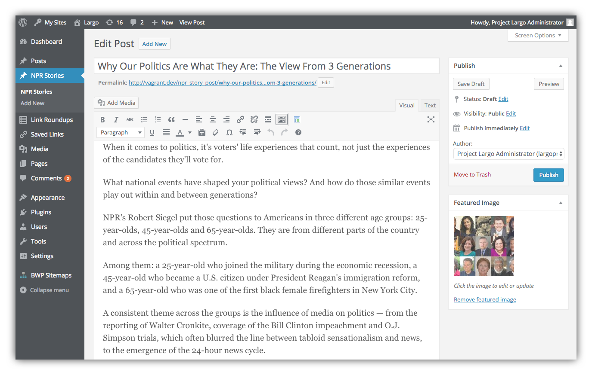
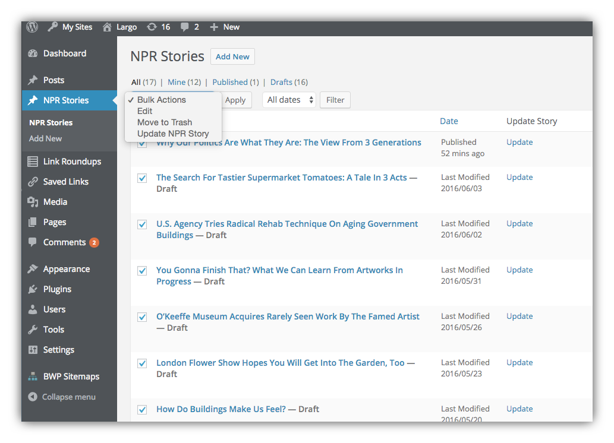

# Pulling Multiple Stories from the NPR Story API By Custom API Query

You can set up and save one or more API queries to pull content based on topic, program, and other filters of your choosing. Once saved, these queries will retrieve new stories every hour, or any time interval you set. 

In the WordPress Dashboard go to **Settings > NPR API Get Multi**. This screen offers several **Query String** fields where you can enter a query string for the NPR Story API. 

Note that "Query String" simply means a URL containing query parameters like a Subject ID, content type, date range, number of results to return, etc. An NPR Story API query string looks something like this:

`https://api.npr.org/query?id=1014,2&requiredAssets=audio&startDate=2016-04-01&endDate=2016-06-05&dateType=story&output=NPRML&numResults=10`

You can enter multiple query strings to pull content for different subjects, programs, etc., and set how often the queries will run. Once you save one or more queries, WordPress will continue to run them against the NPR Story API and return fresh stories as  WordPress Posts or Drafts.

## How to Create a Query String

You can easily create query strings for API content by visiting the [NPR Story API Query Generator](https://www.npr.org/api/queryGenerator.php). The Query Generator provides a graphical user interface to create queries by topic, blogs, program, series, stations, and other values in the NPR Story API. Note that the **Control** tab of the Query Generator adds filtering by date or date range, search terms, and content type. You can also specify the number of results to return for a given query. 

After creating a query in the Query Generator, click the button to **Create API Call**:

After you click the button to create your API call, you'll find the full URL of the query in the **Generated API Call** window:

Now copy the API call string up to the last segment `&apiKey=demo`. Do not include this in copying the query string. _(That segment would only be useful if you were going to run the query in the Query Generator itself, which we're not doing here.)_

Now that you've created and copied a query string, return to your WordPress Dashboard and the **Settings > NPR API Get Multi** page. Paste the string into one of the Query String fields. Use the dropdown menu to set whether stories returned from the API should be saved as Drafts or Posts:

When you click **Save Changes**, WordPress will begin pulling NPR Story API content. Note that it may take up to an hour before stories begin showing up as Posts or Drafts.

You can add more queries any time. If you run out of Query String fields, just increase the **Number of things to get** setting to add more fields.

## Where to Find the Pulled Stories 

If in **Settings > NPR API > NPR Pull Post Type** you selected a post type for pulled content, you'll find pulled stories in the relevant posts screen for that post type. For example if you selected `npr_story_post` as the NPR Pull Post Type, WordPress will store pulled stories in the NPR Stories screen:

Now you can edit any pulled story much like any other post. Although note that unlike regular WordPress posts, you can't add Categories or Tags to NPR Stories.

## Updating Pulled Stories

NPR often updates stories and pushes the updates to the NPR Story API. The same is true for other sources of content in the NPR Story API. You can easily update any stories you pulled from the API by visiting the **Posts** screen for your NPR Pull Post Type, and using the **Update NPR Story** Bulk Action:

