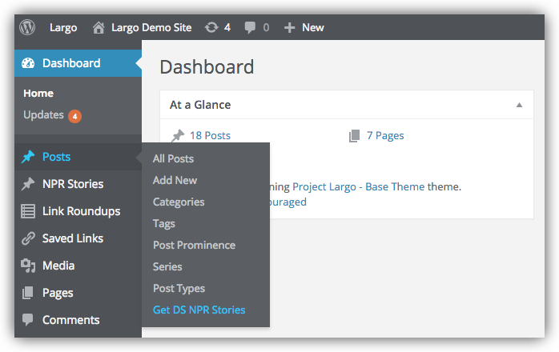
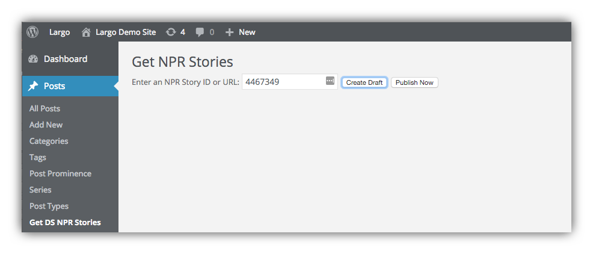
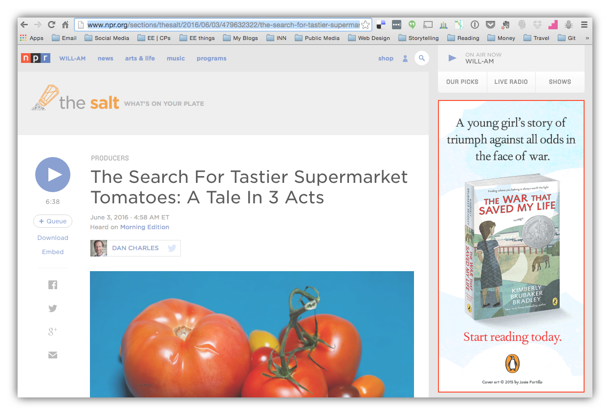
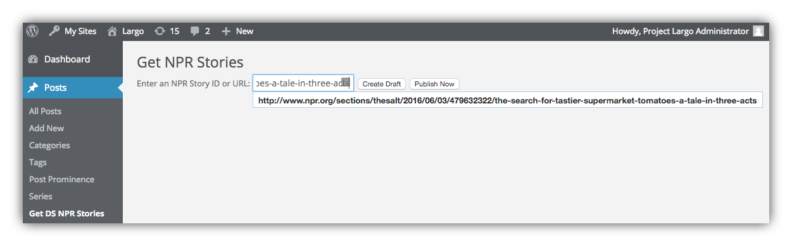
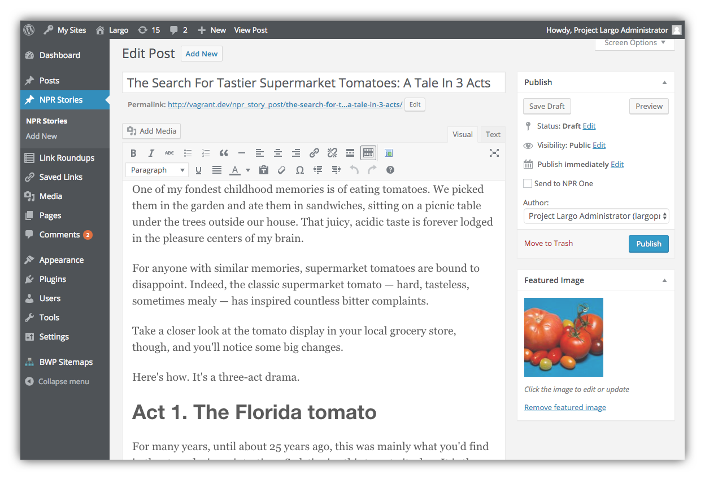
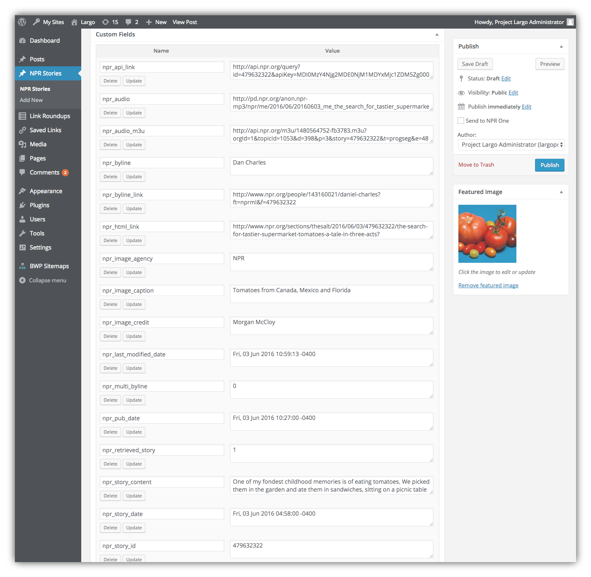

# Pulling a Single Story from the NPR Story API

Once you have the [NPR Story API Plugin configured](/docs/settings.md), you can easily pull a story from the API into WordPress using a Story ID or URL.

In the WordPress Dashboard under **Posts** you will see a link for **Get NPR Stories**:

This opens a screen with a single field where you can paste a Story ID:

Alternatively, you can copy the full URL of a story from the NPR website:

Then paste the URL into this field:

You have the choice to create a draft post of the story, or publish the story immediately. Either way you can edit the story like any other WordPress post:

## NPR Story Custom Fields

Stories in the NPR Story API contain a lot of metadata. When you pull a story from the API, WordPress will store this metadata in custom fields. This may include audio files, bylines, image captions and credits, and many other values including the story ID:

If you don't see these custom fields in the post edit screen, click **Screen Options** in the upper right and then the checkbox for Custom Fields.

## Using NPR Story API Custom Fields in your WordPress theme

The custom fields generated by the NPR Story API provide a lot of flexibility for displaying API content in various ways. If you are familiar with WordPress theming, you could customize your WordPress theme to use the custom fields in your templates. For a reference on how to use these additional fields in your theme, refer to [the relevant documentation](https://codex.wordpress.org/Custom_Fields) in the WordPress Codex.
