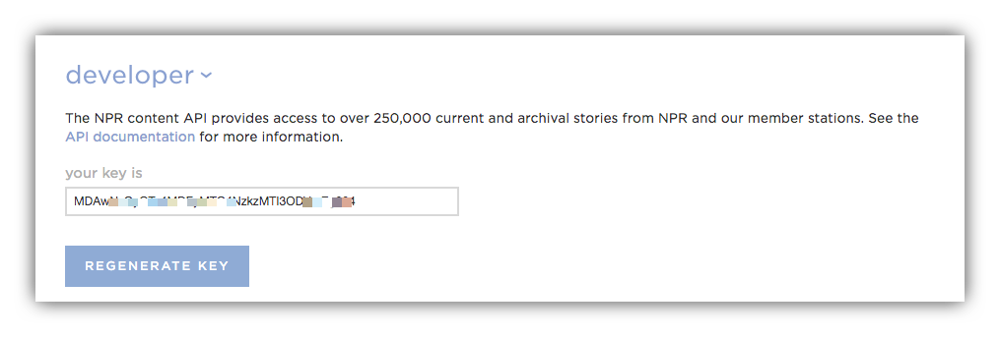
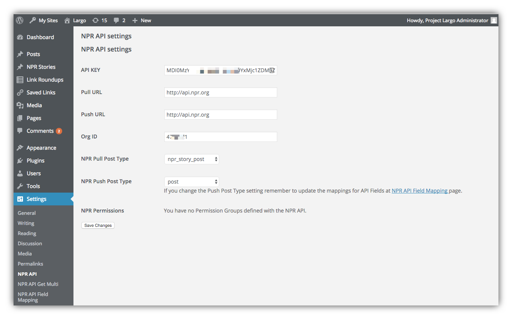

# Plugin Settings

## Before you start

To pull content from the NPR API you'll need an API Key which you can get by [registering for an NPR account](http://www.npr.org/account/signup). Once your account is approved by NPR you can [sign in](http://www.npr.org/account/login) and copy your NPR API key from the developer section at the bottom of the page:

If you are planning to push content to the NPR API you'll also need an NPR API Org ID. If you are an NPR station or affiliated producer you can find your Org ID at [NPR StationConnect](https://stationconnect.org/login?redirect=%2F). 

If you don't have an Org ID or don't intend to push content into the NPR API you can still pull content from the API, but be mindful of the [Terms of Use](http://www.npr.org/about-npr/179876898/terms-of-use).

## Configure your settings

With your API Key in hand, visit the **Settings > NPR API** settings screen in your WordPress dashboard. Enter your API Key, and if available your Org ID. 

For the producation API, the value for both Pull URL and Push URL is `http://api.npr.org`. If you wish to use the sandbox version of the API for testing, the URL for both Push and Pull is `https://api-s1.npr.org`.

For NPR Pull Post Type you can leave the default or pick a custom post type. You can pull stories into the custom post type to keep them organized separately from your site's regular posts. For example if you select an NPR Pull Post Type of `npr_story_post` you will find all pulled stories in a new dashboard link labelled **NPR Stories**, just below the dashboard link for **Posts**.

For NPR Push Post Type you can leave the default or set it to another post type, like `post`. 

If you have configured any Permissions Groups for content you distribute through the NPR API you can optionally add them in the NPR Permissions setting. Note that by default all content in the NPR API is open to everyone, unless you restrict access to a Permissions Group. For more on setting these up see the [NPR API Content Permissions Control page](https://nprsupport.desk.com/customer/en/portal/articles/1995557-npr-api-content-permissions-control).

Once you have all the above entered your settings panel should look something like this:

Hit **Save Changes** and you're ready to start using the NPR API.
